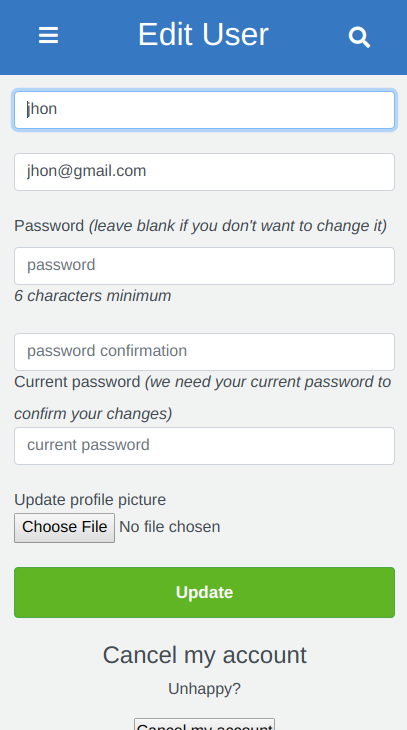
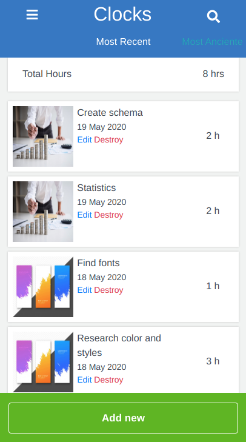
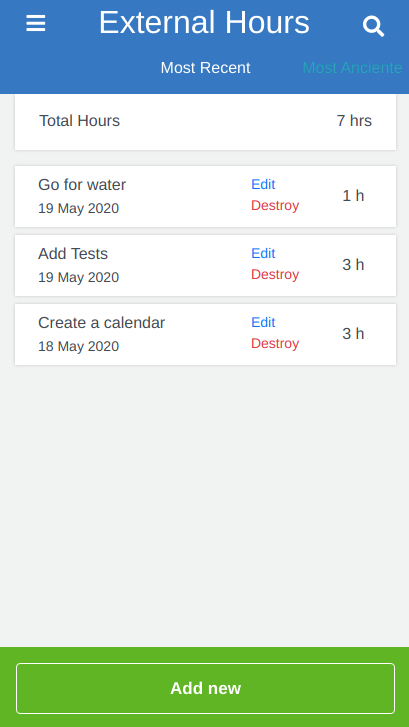
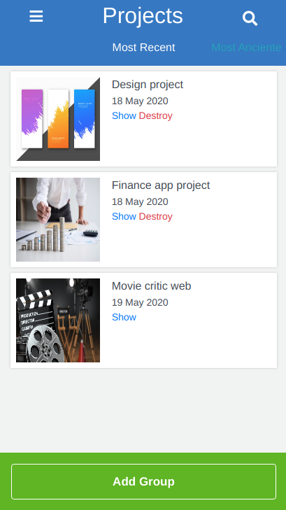

# Ruby on Rails Capstone Project: Group our transactions

> This project was built for mobile screens as part of the Microverse curriculum. The objective is to keep track of the hours you spend on a specific task when working on a project.

## Features
- Users can Log in with proper authentication(email and password), and have a default user profile image that can be updated in the account settings.
- Users can create a task where you enter the hours spent and can be assigned to a Project.
- When you click on 'My Hours' you can see a list of your tasks assigned to a specific project and the total hours you registered. This list shows only the tasks created by you.
- When you click on 'Non Categorised hours' you can see a list of tasks not assigned to a specific project when created and the total hours of those tasks.
- Inside My Hours and Projects, you can create a new task or Project with the 'Add new' button.
- Also, you can edit and delete all the tasks and projects created by you. If you delete a Project all the tasks assigned to that project will be deleted as well.

## Mobile Views

### Account Setting
- Here you can upload your own profile photo



### Pages
- Tasks Index



- Non Categorised tasks index



- Projects Index



## Built With

- Ruby v2.6.5
- Ruby on Rails v6.0.3

## Live Demo

[Heroku Demo Link](https://fast-woodland-21539.herokuapp.com/)

### Log in details

    user: jhon@gmail.com
    password: 123456

### Live demo usage

- Go to Project link and click "Add Group".
- Go to Clock link and create a new task, insert the hours spent and assign it to a project.
- Then you can check all your projects and created tasks in their respectives link.

## Getting Started

To get a local copy up and running follow these simple example steps.

### Prerequisites

Ruby: 2.6.5
Rails: 6.0.3

### Setup

Install gems with:

```
bundle install
```

Setup database with:

```
   rails db:create
   rails db:migrate
```

### Usage after download or clone repository

Start server with:

```
    rails server
```

Open `http://localhost:3000/` in your browser.

### Run tests

```
    rpsec --format documentation
```

## Future Features

- Create private projects where a user can invite friends.
- Friends are able to accept or decline invitations to collaborate in projects.

## Author

👤 **Luis Saavedra**
- Github: [@nriqu322](https://github.com/nriqu322)
- Twitter: [@nriqu322](https://twitter.com/nriqu322)
- Linkedin: [Linkedin](https://linkedin.com/in/luis-saavedra-sanchez/) 


## 🤝 Contributing

This is a project for educational purposes only. We are not accepting contributions.

## Show your support

Give a ⭐️ if you like this project!

## Acknowledgments
- Design taken from [Snapscan](https://www.behance.net/gallery/19759151/Snapscan-iOs-design-and-branding?tracking_source=) by [Greogoire Vella](https://www.behance.net/gregoirevella) 
- [Microverse](https://microverse.org)
